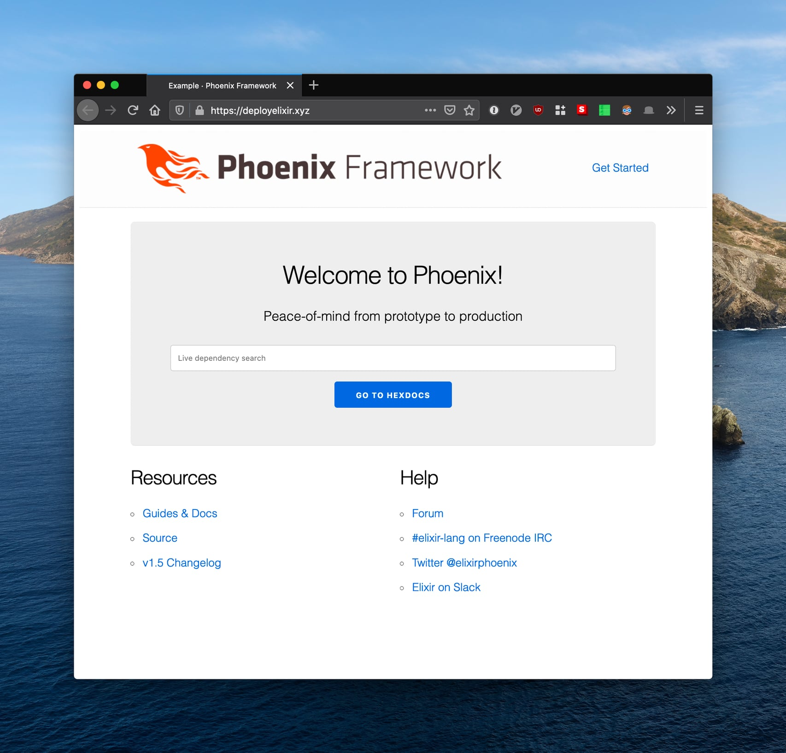

# Automating Elixir Deployment - Example Repo

## TOC
* [What Is This?](#what-is-this)
* [Demo](#demo)
* [Deployment Instructions](#deployment-instructions)
  * [Setup Pulumi](#setup-pulumi)
  * [Deploy Using eDeliver](#deploy-using-edeliver)
* [Running Locally](#running-locally)
* [About](#about)

## What Is This?

This is a companion repository for blog posts I wrote for the [Hashrocket](https://hashrocket.com) blog:

  * [Automate Your Infrastructure with Pulumi](https://hashrocket.com/blog/posts/automate-your-infrastructure-with-pulumi)
  * [Automate Your Elixir Deployments - Part 1 - Ansible](https://hashrocket.com/blog/posts/automate-your-elixir-deployments-part-1-ansible)
  * [Automate Your Elixir Deployments - Part 2 - Distillery & eDeliver](TODO!)


## Demo
[See it live!](https://deployelixir.xyz)



## Deployment Instructions
### Setup Pulumi

1. Get a [Digital Ocean](lhttps://bit.ly/create-digital-ocean-account) API key
2. Export it in your shell:

   ```bash
   export DIGITALOCEAN_TOKEN='your token.......'
   ```

3. Install dependencies:

   ```bash
   $ mix setup
   ```

4. Select a stack:

   ```bash
   $ mix pulumi stack select prod
   ```

   Look in `infra/Pulumi.prod.yaml` and change it according to your needs.

   You will need a [domain name](https://www.namecheap.com/) with name servers
   pointed at:

   ```
   ns1.digitalocean.com
   ns2.digitalocean.com
   ns3.digitalocean.com
   ```

   This may take a bit to propagate.


4. Run `pulumi up`:

   ```bash
   mix pulumi up --yes
   ```

### Setup Ansible
1. Create a vault password file:

   ```bash
   $ echo 'topsecret' > ansible/.vault-password
   ```

   Replace `topsecret` with a password generated by your password manager.

2. Remove existing secret files and create your own using the password you
   specified above:

   ```bash
   $ cd ansible
   $ rm inventories/group_vars/all/secret/all.yml
   $ ansible-vault create inventories/group_vars/all/secret/all.yml
   ```

   It should look like this:

   ```yaml
   ---
   secret_admin_email: admin@example.com
   ```

   Replace with your own email, save and exit the file.

   Now do the same for the phoenix secrets file:

   ```bash
   $ rm inventories/group_vars/application/secret/phoenix.yml
   $ ansible-vault create inventories/group_vars/application/secret/phoenix.yml
   ```

   It should look like this:


   ```yaml
   ---
   secret_secret_key_base: 'run mix phx.gen.secret to generate'
   secret_erlang_cookie: 'run mix phx.gen.secret to generate'
   ```

   In a separate terminal generate the secrets using `mix phx.gen.secret`, paste
   them into the file, save and exit.

3. Change directories back up to the root of the project and run:

   ```bash
   $ mix ansible
   ```

### Deploy Using eDeliver
Once the server is fully provisioned by Pulumi and Ansible, you should be able
to build a release:

```bash
$ mix edeliver build release
```

The output should look like:

```
BUILDING RELEASE OF EXAMPLE APP ON BUILD HOST

-----> Authorizing hosts
-----> Ensuring hosts are ready to accept git pushes
-----> Pushing new commits with git to: deploy@example.com
-----> Resetting remote hosts to 26b6853c000982d80466818c7a1028e392b60483
-----> Cleaning generated files from last build
-----> Updating git submodules
-----> Fetching / Updating dependencies
-----> Build static assets
-----> Compiling sources
-----> Generating release
-----> Copying release 0.1.0+1-26b6853 to local release store
-----> Copying example.tar.gz to release store

RELEASE BUILD OF EXAMPLE WAS SUCCESSFUL!
```

Copy the release version and use it to deploy the release to production:


```bash
$ mix edeliver deploy release to production --version=0.1.0+1-26b6853
```

When the deploy is finished, restart the production release:

```bash
$ mix edeliver restart production
```

## Running Locally
To start your Phoenix server:

  * Setup the project with `mix setup`
  * Start Phoenix endpoint with `mix phx.server`

Now you can visit [`localhost:4000`](http://localhost:4000) from your browser.

## About
[](https://hashrocket.com)

Bullets.vim is kindly supported by [Hashrocket, a multidisciplinary design and development consultancy](https://hashrocket.com). If you'd like to [work with us](https://hashrocket.com/contact-us/hire-us) or [join our team](https://hashrocket.com/contact-us/jobs), don't hesitate to get in touch.
